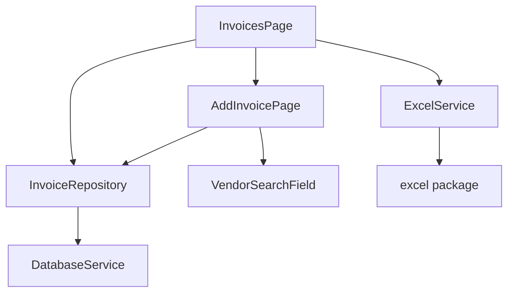

# Requirements

### Overview & Goals
The goal is to implement a professional "Electronic Invoices" section in the application. This section will allow users to quickly record tax invoices, manage supplier data, and generate professional Excel reports for financial auditing.

### Scope
- **In Scope**:
  - A new "Electronic Invoices" section accessible from the drawer.
  - Supplier (Vendor) management with smart search and auto-fill.
  - Invoice recording with auto-sequenced numbering and automatic tax calculations.
  - Smart live search across multiple invoice fields.
  - Professional Excel export for any chosen period.
  - Confirmation-based deletion.
- **Out of Scope**:
  - OCR or automatic invoice scanning.
  - Integration with external tax authorities (ZATCA, etc.).

### User Stories
- As a user, I want to record an invoice quickly by only entering the vendor and the total amount.
- As a user, I want the system to calculate the VAT and pre-tax amount automatically to save time.
- As a user, I want to search for a vendor by their short name for faster data entry.
- As a user, I want to export a professional Excel report of all invoices for a specific month to share with my accountant.

### Functional Requirements
- **Vendor Management**: Store official name, short name (search-only), and tax ID.
- **Invoice Entry**:
  - Auto-incrementing invoice number (editable).
  - Default current date (editable).
  - Smart vendor selection (auto-fills official name and tax ID).
  - Auto-calculation: Total Amount -> (VAT 15%, Before Tax).
- **Search**: Live search by Invoice #, Vendor name (Official/Short), Tax ID, Date, or Hotel.
- **Reporting**: Excel export with specific columns and professional formatting.
- **Security**: Mandatory confirmation dialog before any deletion.

# Technical Design

### Current Implementation
The app currently manages hotels, financial reports, and settlements using SQLite. It has an existing `ExcelService` for financial reports and a consistent UI pattern using `AppCard` and a custom `AppDrawer`.

### Key Decisions
1. **Database Schema**:
   - Use a separate `vendors` table to normalize data and enable the "search by short name" feature.
   - Store `hotel_id` in each invoice to ensure entity independence.
2. **Auto-Calculation Logic**:
   - VAT (15%) will be calculated as `Total * (15 / 115)`.
   - Before Tax will be `Total - VAT`.
3. **UI Patterns**:
   - Use a `CustomSearchDelegate` or a dynamic overlay for vendor selection to keep the entry flow fast.
   - Maintain the RTL (Arabic) layout and existing color scheme (`AppColors.primary`).

### Architecture Diagram

### Proposed Changes
- **Data Layer**:
    - `lib/core/database/database_service.dart`: Add migration to version 9.
    - `lib/models/vendor.dart`: Define vendor entity.
    - `lib/models/electronic_invoice.dart`: Define invoice entity.
    - `lib/repositories/invoice_repository.dart`: Data access logic.
- **Presentation Layer**:
    - `lib/pages/invoices/`: New directory for all invoice-related screens.
    - `lib/widgets/common/app_drawer.dart`: Add link to invoices.
- **Service Layer**:
    - `lib/services/excel_service.dart`: Add invoice export logic.

### File Structure
- `lib/models/vendor.dart`
- `lib/models/electronic_invoice.dart`
- `lib/repositories/invoice_repository.dart`
- `lib/pages/invoices/invoices_page.dart`
- `lib/pages/invoices/add_invoice_page.dart`
- `lib/pages/invoices/invoice_details_page.dart`
- `lib/pages/invoices/widgets/vendor_search_field.dart`

# Testing

### Validation Approach
I will verify the functionality by simulating the data entry flow and checking the database state and calculations.

### Key Scenarios
1. **Fast Entry Flow**:
   - Select an existing vendor -> Enter Total Amount -> Check if VAT and Before-Tax are correct -> Check if Hotel selection is focused.
2. **Vendor Management**:
   - Create a new vendor -> Ensure they appear in subsequent searches by both official and short names.
3. **Excel Export**:
   - Generate report -> Verify columns: Invoice No, Date, Company, Tax ID, Amount Before Tax, VAT, Total, Hotel.
4. **Search**:
   - Verify that typing a short name immediately shows the correct vendor.
5. **Deletion**:
   - Verify that clicking delete shows a dialog and doesn't delete until confirmed.

# Delivery Steps

###   Step 1: Database and Data Models Setup
Update the database schema to support the new feature.
- Update `DatabaseService.initDatabase` version to 9.
- Add `vendors` table to store supplier details (official name, short name, tax ID).
- Add `electronic_invoices` table to store invoice data, linked to vendors and hotels.
- Implement `onUpgrade` logic for existing installations.
- Create `Vendor` and `ElectronicInvoice` models in `lib/models/`.

###   Step 2: Implement Invoice Repository
Create a repository to handle all invoice-related data operations.
- Implement `InvoiceRepository` with methods for:
  - Fetching, searching, and saving vendors.
  - CRUD operations for electronic invoices.
  - Searching invoices with the specified filters.
  - Generating auto-sequenced invoice numbers.

###   Step 3: Invoice List and Details UI
Develop the main listing and details screens for electronic invoices.
- Create `InvoicesPage` with a live search bar and a list of invoices.
- Implement `InvoiceDetailsPage` to display full invoice information and handle deletion with confirmation.
- Update `AppDrawer` to include a navigation item for the new section.

###   Step 4: Invoice Creation Form and Automation
Build the invoice creation form with the required automation.
- Create `AddInvoicePage` with fields for invoice #, date, vendor, amounts, and hotel.
- Implement `VendorSearchField` widget for smart, live searching and selecting vendors.
- Add auto-fill logic for company name and tax ID upon vendor selection.
- Implement automatic VAT (15%) and Before-Tax calculations based on the Total Amount entry.
- Ensure the focus moves automatically to the next logical field (Hotel selection).

###   Step 5: Excel Reporting and Sharing
Extend the `ExcelService` to support invoice reporting.
- Add `exportInvoicesReport` method to `ExcelService`.
- Implement date range selection in `InvoicesPage`.
- Generate a professional Excel file with the specific column order and formatting (Invoice No, Date, Company, Tax ID, Amount Before Tax, VAT, Total, Hotel).
- Integrate with `share_plus` for easy distribution.